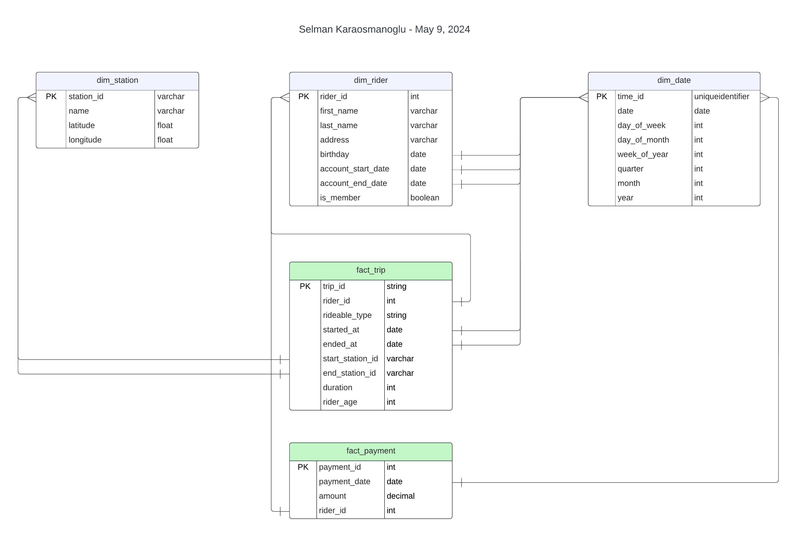

By Selman Karaosmanoglu

## Date created
09 May 2024

# Building a Data Lakehouse using Azure Databricks

## Overview

Data Lakehouse Solution

This project aims to create a robust data lakehouse using Azure Databricks. Key steps include:

- Design Star Schema according to business outcomes.
- Ingest the data into Azure Databricks DBFS.
- Extract the data from CSV files into delta files.
- Load the data by creating tables from delta files using Databricks.
- Transform the data by using Spark and Databricks. Create fact and dimension tables.

The dataset shown below encompasses anonymized trip data from the Divvy bike sharing program in Chicago.

### 1. Design Star Schema

The star schema, designed according to the following business outcome: 

Analyze how much time is spent per ride
- Based on date and time factors such as day of week and time of day
- Based on which station is the starting and / or ending station
- Based on age of the rider at time of the ride
- Based on whether the rider is a member or a casual rider

Analyze how much money is spent
- Per month, quarter, year
- Per member, based on the age of the rider at account start

## Requirements

Language: Python 3.9

Libraries: Apache Spark

## Credits
Udacity Data Engineer Nanodegree Program